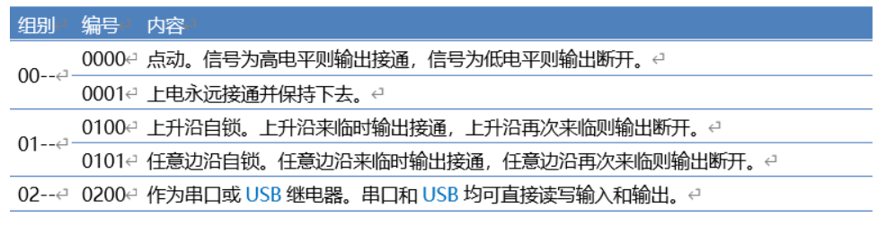
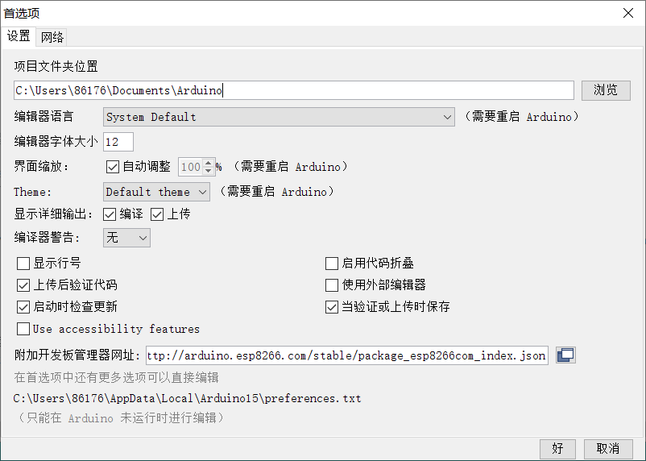
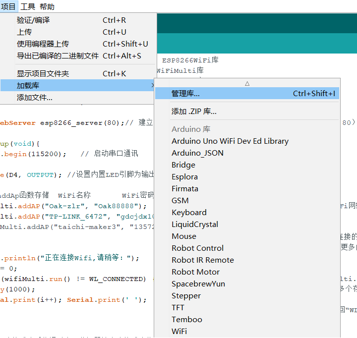

# -WiFi-
改造普通灯变为WiFi灯
------------------------------------------------------------------------------------------------------------------------
一、项目目的

1、能够改造普通灯变成WiFi控制灯

二、项目环境

1、NodeMCU（ESP8266）开发板一块（其他WiFi开发板也可以）

2、高低电平继电器模块一个

3、普通USB灯一个

4、220V-5V变压器（根据具体情况选型）

5、杜邦线若干

6、手机一台

7、Arduino IDE开发环境

8、VS code 开发环境

三、项目原理

通过继电器控制原理，ESP8266模块原理，HTTP/HTTPS服务器程序原理并将继电器、ESP8266模块、电源模块、编写的网站按钮以及USB灯连通，实现其变成WiFi灯。

(1)继电器控制原理

电磁式继电器一般由铁芯、线圈、衔铁、触点簧片等组成的。只要在线圈两端加上一定的电压，线圈中就会流过一定的电流，从而产生电磁效应，衔铁就会在电磁力吸引的作用下克服返回弹簧的拉力吸向铁芯，从而带动衔铁的动触点与静触点（常开触点）吸合。当线圈断电后，电磁的吸力也随之消失，衔铁就会在弹簧的反作用力返回原来的位置，使动触点与原来的静触点（常闭触点）释放。这样吸合、释放，从而达到了在电路中的导通、切断的目的。

本次使用的继电器型号为C4G010，该产品是一款以专用集成电路为核心的多功能单路数字延时模块。它具备一路触发信号输入和一路输出，并具备数码管和按钮可供现场配置功能。

(2)ESP8266模块原理

ESP8266是一款串口WiFi模块，内部集成MCU能实现单片机之间串口同信；这款模块简单易学，体积小，便于嵌入式开发。 ESP8266 是一个完整且自成体系的Wi-Fi网络解决方案，能够搭载软件应用，或通过另一个应用处理器卸载所有Wi-Fi网络功能。 ESP8266在搭载应用并作为设备中唯一的应用处理器时，能够直接从外接闪存中启动。 内置的高速缓冲存储器有利于提高系统性能，并减少内存需求。 ESP8266强大的片上处理和存储能力，使其可通过GPIO口集成传感器及其他应用的特定设备，实现了最低前期的开发和运行中最少地占用系统资源。 ESP8266高度片内集成，包括天线开关balun、 电源管 理转换器，因此仅需极少的外部电路，且包括前端模块在内的整个解决方案在设计时将所占PCB空间降到最低。

(3)HTTP/HTTPS服务器程序原理

超文本传输协议（HTTP：Hypertext Transport Protocol）是万维网应用层的协议，通过两个程序实现：一个是客户端程序（各种浏览器），另一个是服务器 （常称Web服务器）。这两个通常运行在不同的主机上，通过交换报文来完成网页请求和响应，报文可简单分为请求报文和响应报文。

用户通过客户端向服务端发起一个请求，创建一个TCP连接，指定端口号，默认是80，然后连接到服务器工作。在那个端口监听浏览器请求。一旦监听到客户端请求，分析请求类型后，服务器会向客户端返回一个响应状态，比如"HTTP/1.0 404 OK"，同时会返回特定的数据内容，如请求的资源，错误代码，其它状态信息等等。

四、项目步骤与结果

1.依据如下电路设计图将继电器、电源模块、WiFi模块和USB灯通过杜邦线连接好，USB灯通电能亮

 

2.配置继电器，使之为高电平接通低电平断开

3.通过Arduino为NodeMCU编写程序，变成HTTP/HTTPS服务器，且有继电器控制功能。

(1)编写程序前应先安装好NodeMCU的串口驱动

(2)配置Arduino，打开Arduino，IDE->菜单项文件->首选项，然后会看到附加开发版管理器网址，填入http://arduino.esp8266.com/stable/package_esp8266com_index.json，重启IDE；

       
(3)设置串口
   

(4)添加ESP8266库

  
4.编写具有发送HTTP/HTTPS功能的网站。

本次实验中的网站，我仅仅只编写了一个按钮，使其具有发送HTTP/HTTPS功能

5.烧录程序

6.测试程序

烧录成功后，连接到TP-LINK_6472，分配IP地址为192.168.1.103

7.手机通过IP地址进入网站，点击按钮向服务器发起申请，发出请求，控制开关灯

8.演示视频：改造普通灯变为Wi-Fi灯_哔哩哔哩_bilibili https://b23.tv/9pss5Pi

五、项目总结

本次实验所涉及的领域大多数是之前从未接触过的，所以花费了一定的时间去学习各硬件的使用方法和了解样例。该实验完成了高电平接通低电平断开设置继电器的要求，并实现了搭建服务器、响应网页请求以及较好的网页交互效果。

实验中遇到的问题与难点的分析与处理：

1.USB灯与电源模块不知道如何连接成通路

2.使用Arduino IDE开发时烧录HTML网页：

一开始了解到有两种方式可以烧录HTML网页，一种是使用flash烧录动态网页存入内存，一种是将HTML文件内容进行字符化压缩，烧录静态网页。考虑到ESP8266 内存较小，故采用了第二种方法。

3.关于网页IP地址的问题：

经过网上查阅资料了解到连接到网络后可动态分配IP地址，也可设置静态IP地址。经过尝试后，发现自己设置的静态IP地址仅仅只是覆盖了分配的动态IP地址，大概率是代码问题，后面就还是选择了动态分配IP地址。

4.控制开灯的方式：

本次实验采用的是连接同一WiFi，使其处于同一网络下实现浏览器访问网页进行控制。也可采用websocket连接电脑与esp8266模块，将ESP8266作为服务器，电脑为client，连接AP模式发出的WiFi，在同一WLAN下向ESP8266模块发送指令控制开关灯，但此种方法需要编写APP，较为困难，且每次连接都需下载APP或打开idex.html文件，所以并未采用。
